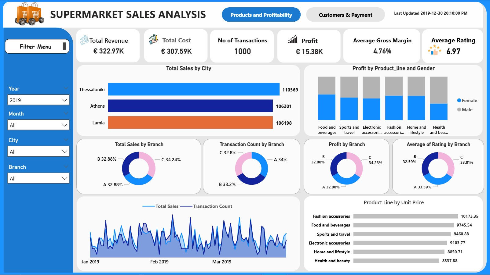
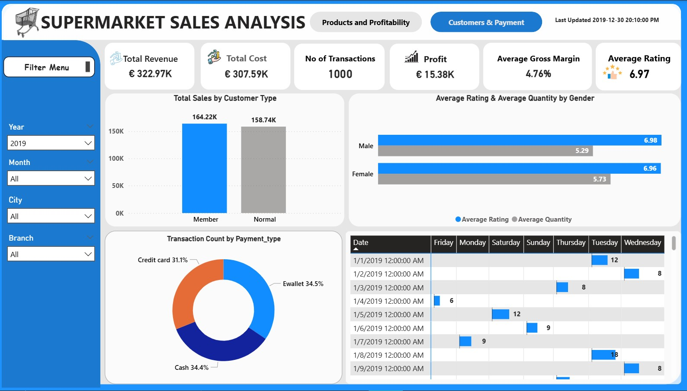

# Supermarket-Sales-Analysis

This project focuses on the analysis of a supermarket sales dataset using Excel, SQL and Power BI to generate actionable insights for business growth.

## 📌 Project Summary

 This project demonstrates my ability as a Data Analyst to clean, analyze, and visualize business data end-to-end, transforming raw supermarket transactions into clear, actionable insights for decision-makers.

Using Excel, SQL, and Power BI, I analyzed sales performance, customer behavior, product profitability, and operational trends, then delivered insights through an interactive Power BI dashboard designed for management use.

Tools Used: Excel | SQL | Power BI 

Dataset: 1,000 supermarket transactions (Kaggle)

Time Period: Jan – Mar 2019 

## 💼 Business Problem

The supermarket needed to understand:

- Which products, branches, and customers drive profitability
- How customer demographics and payment methods affect revenue
- Where margins are tight and operational improvements are needed
- How sales vary across time to support staffing and promotions

## 🧰 Tools & Technologies
- Excel – Data cleaning, transformation, and standardization
- SQL – Data extraction and analytical queries
- Power BI – DAX measures, dashboard design, and visualization

## 📂 Dataset Description

Key fields in the dataset include:

- Invoice_ID – Unique transaction identifier
- Branch & City – Transaction location
- Customer_type & Gender – Customer demographics
- Product_line – Product category
- Unit_price, Quantity, COGS, Total, Tax, Gross Income – Financial metrics
- Payment_type – Cash, E-wallet, Credit Card
- Date & Time – Transaction timestamp
- Rating – Customer satisfaction score

## 🔄 Data Preparation (Excel)
- Cleaned and standardized the dataset
- Corrected date data types for time-based analysis
- Normalized fields for consistency and accuracy

## 🧮 Data Analysis (SQL)

Key SQL analyses included:

1. Customer Spend Analysis
- Members spend more per purchase, especially female members
- Female customers generate higher total sales
- Normal male customers purchase more frequently but spend less per transaction

2. Product Demand Analysis
- High-demand product lines identified using average quantity thresholds
- Electronic accessories, health & beauty, and home & lifestyle show strong demand

3. ranch Performance & Ratings
- Branch A recorded the highest overall customer ratings
- Indicates stronger customer experience compared to other branches

4. Pricing Analysis
- Fashion accessories have the highest unit prices, contributing significantly to revenue

_You can access the SQl scripts File_ [here](https://github.com/ErickHdez616/Supermarket-Sales-Analysis/blob/main/Supermarket_sales_SQL%20analysis.sql)

## 📈 Power BI Dashboard
**
Key KPIs** 

- Total Revenue
- Total Cost (COGS)
- Gross Profit & Gross Margin %
- Transactions
- Average Order Value
- Average Rating

**
DAX Measures** 

- Revenue, Cost, Profit, Gross Margin %
- Transactions & Average Basket Size
- Sales by Branch, Product Line, Payment Type, and Customer Type

## 🖥️ Dashboard Pages
**
Page 1: Products & Profitability** 

- KPI cards for sales, profit, margin, and ratings
- Branch performance comparison
- Product line profitability by gender
- Monthly sales trend analysis

**
Page 2: Customers & Payments** 

- Sales by customer type and gender
- Transactions by payment method
- Weekday vs date sales heatmap
- Gender-based comparison of ratings and purchase quantity

## 🔍 Key Business Insights
**
Financial Performance**

- €322.97K total revenue with €15.38K gross profit
- 4.76% gross margin, highlighting margin pressure and optimization needs

**
Customer Behavior**

- Loyalty members generate higher revenue
- Customer satisfaction is solid (6.97/10) but has room for improvement

**
Product & Branch Performance**

- Food & Beverages and Sports & Travel are top revenue drivers
- Profitability varies by branch, indicating operational differences
  
**
Payments & Time Trends**

- Balanced payment mix with strong e-wallet adoption
- Higher sales activity on Tuesdays and Fridays

_You can interact with the dashboard File_ [here](https://github.com/ErickHdez616/Supermarket-Sales-Analysis/blob/main/Supermarket_sales_dashboard.pbix)

## 🎯 Business Impact

This analysis enables management to:

- Identify profitable products and customers
- Improve operational efficiency
- Make informed pricing and marketing decisions
- Monitor performance using real-time KPIs

## 👤 About Me

Eric – Data Analyst

I help businesses turn raw data into meaningful insights through data cleaning, analysis, visualization, and storytelling.

📫 Feel free to connect with me on LinkedIn or explore my other projects on GitHub.

